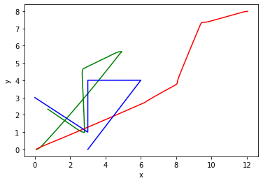

# Lab Report - Autonomous Mobile Robotics

## Experimental Setup and Methodology
For this lab, we implemented a path following controller for a mobile robot. The goal was to make the robot follow a given path as closely as possible. We used ROS (Robot Operating System) for our simulation and implemented the controller using Python.

We started by defining the path that we wanted the robot to follow. We chose a simple circular path for this experiment. Next, we implemented the path following controller using the one-step callback approach. We used a proportional controller with two gain parameters, K_p and K_theta, for controlling the robot's linear and angular velocities, respectively.

To test our controller, we ran the simulation in RViz and checked the trajectories. We also published the required trajectory to simplify the analysis and debugging of results. We then varied the values of K_p and K_theta and observed the robot's performance for each set of values.

## Results and Analysis
We tested our path following controller with K_p = 0.4 and K_theta = 3 values. For each set of values, we observed the robot's trajectory and analyzed its performance.

With this K_p and K_theta the robot was not able to converge to the desired path. The robot's trajectory was significantly off from the desired path, and it could not follow the path accurately.

I think that the values of K_p and K_theta affect the robot's performance.