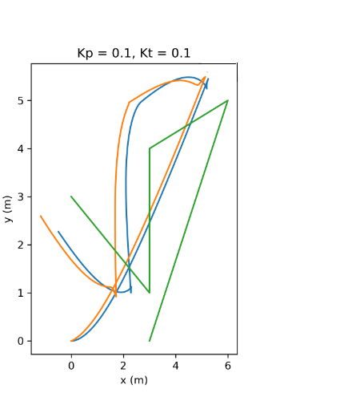

# Lab Report - Autonomous Mobile Robotics

## Experimental Setup and Methodology
For this lab, we implemented a path following controller by pure pursuit and stanley controllers for an ackerman model robot. The goal was to make the robot follow a given path as closely as possible. We used ROS (Robot Operating System) for our simulation and implemented the controller using Python.

We started by defining the path that we wanted the robot to follow. We chose a simple path for this experiment. Next, we implemented the path following controller using the one-step callback approach. We used a proportional controller with two gain parameters, K_p and K_theta, for controlling the robot's linear and angular velocities, respectively.

To test our controller, we ran the simulation in RViz and checked the trajectories. We also published the required trajectory to simplify the analysis and debugging of results.

## Results and Analysis
We tested our path with pure pursuit and stanley controllers. For each set of values, we observed the robot's trajectory and analyzed its performance.
Green line - Ideal path, Blue line - pure pursuit, Yellow line - stanley

